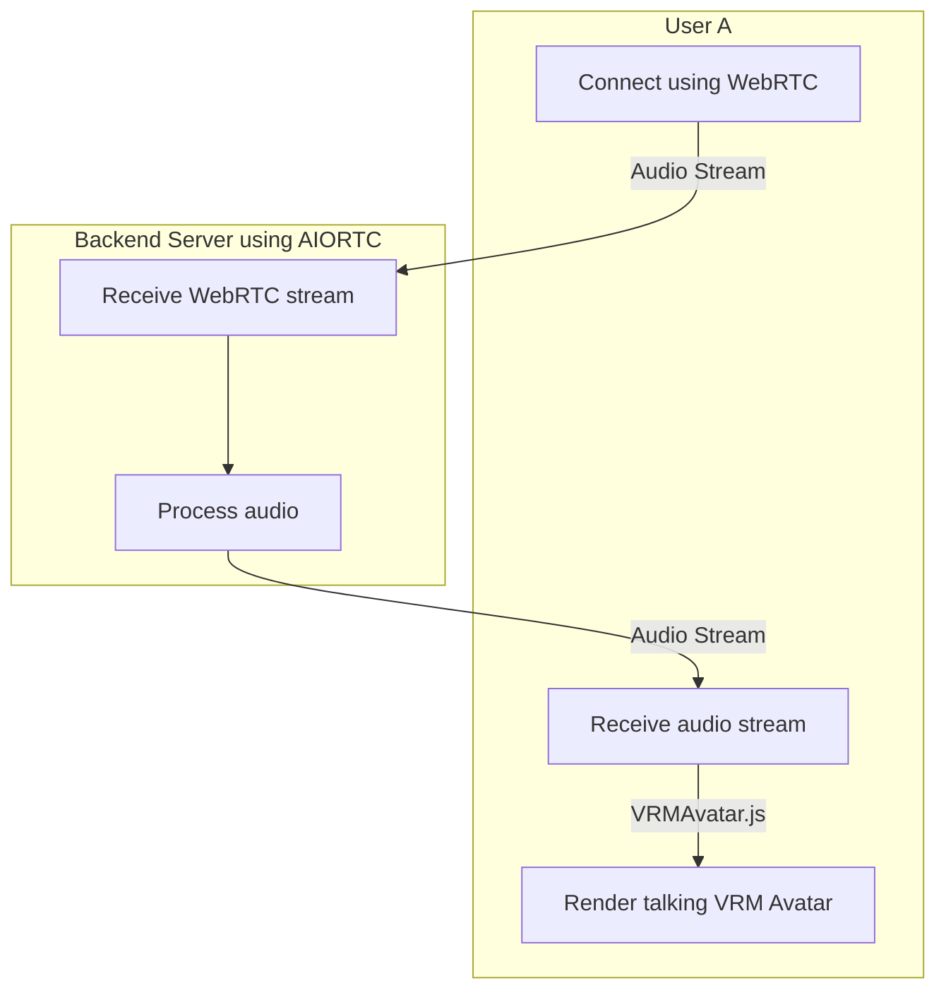

# ChitChatPortraits-RTC
Transmit audio via WebRTC and receive animated video talking portraits. 🗣️🖼️


# Requirements

- Python 3.11
- Conda 23

# Flow Chart



# Getting Started

1.Create a Conda environment:
Open your terminal or Anaconda Prompt, navigate to the project directory, and run the following command to create a new Conda environment using the requirements.txt file:
```
conda create --name myenv --file requirements.txt
```
*If this fails try adding an additional conda channel (e.g: conda-forge)
```conda config --env --add channels conda-forge```

If some packages are still not available on Conda channels and need to be installed from pypi, you can use `pip`.

2.Activate the Conda environment:
To activate the newly created environment, run the following command:
```
conda activate myenv
```

Replace myenv with the name of your environment.

3.Install modules that can't be installed with Conda:
```
pip install -r requirements-pip.txt
```

When you start the example, it will create an HTTP server which you can connect to from your browser:

```
$ python server.py
```
You can then browse to the following page with your browser:
http://127.0.0.1:8080

If you have issues capturing audio, make sure you enabled media access for unsecure sites.

## How to use VRMAvatar
```
import VRMAvatar from "./VRMAvatar.js";
// Instantiate the VRMAvatar class
const myVRM = new VRMAvatar('./models/VRM1_Constraint_Twist_Sample.vrm');
// Call the animate function to display avatar and start the animation with audio stream
myVRM.animate();
myVRM.initializeVoiceToAvatar(audioStream); // passing audio (type MediaStream)
```

## Additional options

If you want to play a media file instead of using the captured mic audio, run:
```
$ python server.py --play-from RecordingWAV.wav
```

## Credit where credit is due:

Initial code examples from:
- https://github.com/aiortc/aiortc/tree/main
- https://github.com/Automattic/VU-VRM
